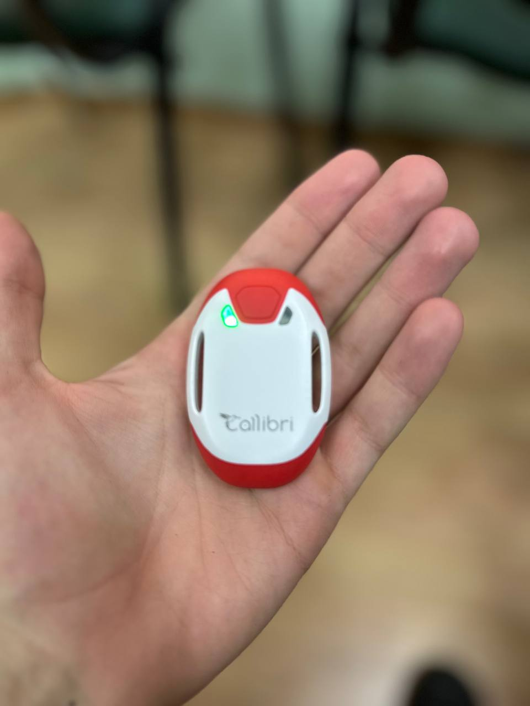
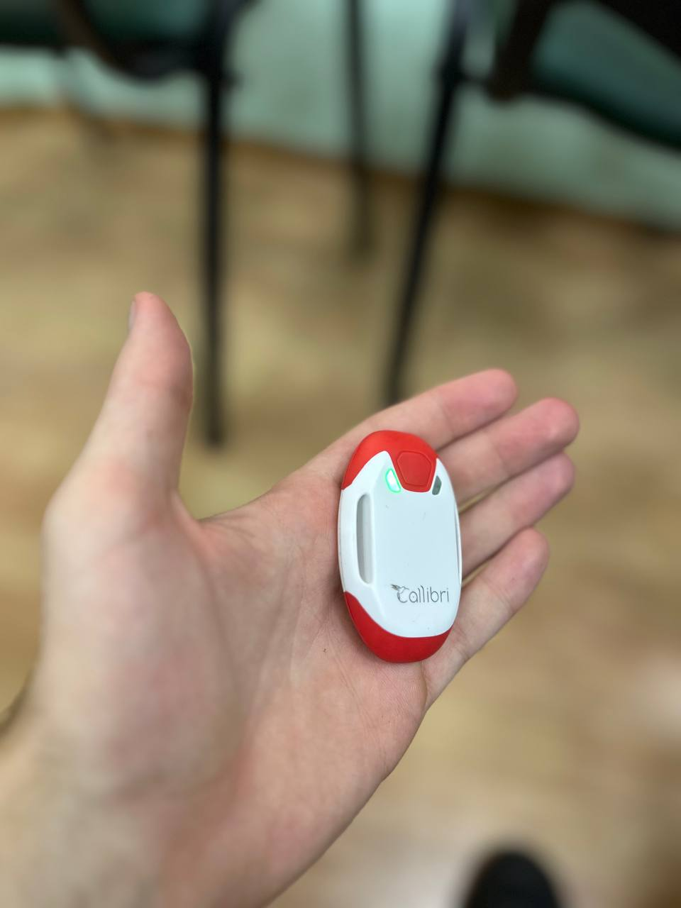
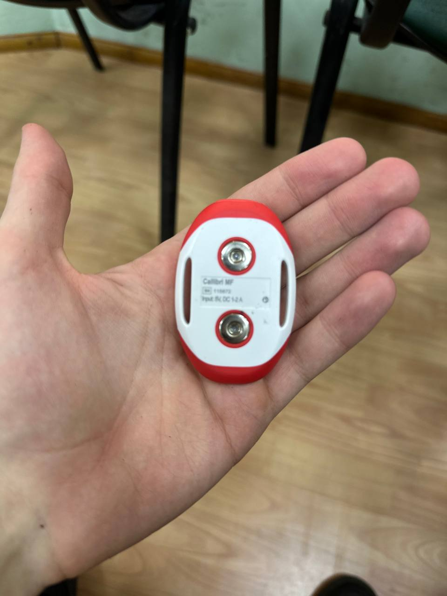
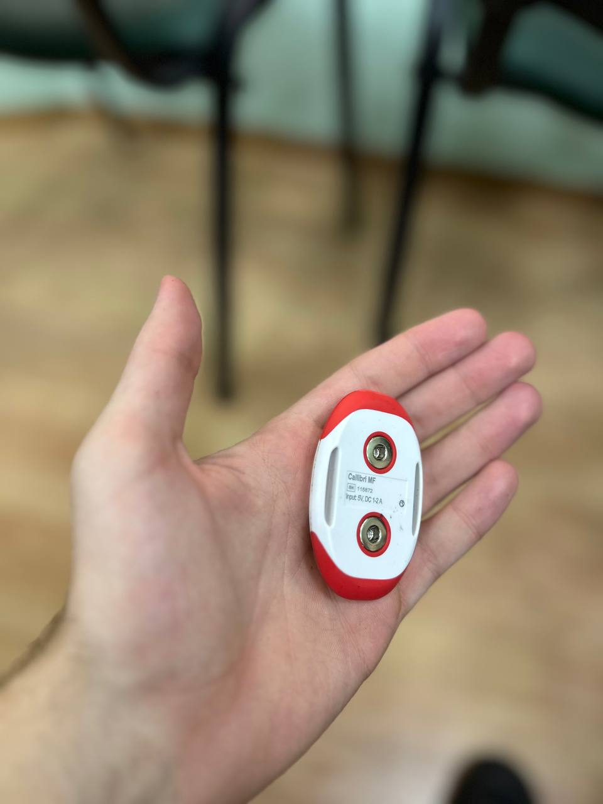

# CallibriControl

Жестовое управление компьютером на базе EMG/MEMS датчика Callibri: курсор, клики, презентации, медиа, браузер и игровые профили. Адаптивные пороги, калибровка под пользователя и готовые схемы действий — подключил, откалибровал, управляешь.

## Почему это круто
- Быстрый онбординг: калибровка baseline/MVC + нейтральная ориентация и сразу в работу.
- Реактивность: адаптивные пороги и профили чувствительности ULTRA/SENSITIVE/NORMAL/PRECISE.
- Готовые действия: курсор, drag, скролл, клики, презентации, браузер, медиа, игровые схемы.
- Богатая база жестов: FLEX/HOLD/RELEASE, DOUBLE/TRIPLE_FLEX, TILT_UP/DOWN/LEFT/RIGHT, SHAKE, FLEX+TILT-комбо.
- Несколько интерфейсов: CLI (ядро), веб (SSE + статика), GUI (PyQt6), демо без датчика.

## Как это работает
1) Потоки: датчик отдаёт EMG (raw или envelope) и MEMS (наклоны/аксель/кватернионы).  
2) Калибровка: снимаем baseline + MVC, запоминаем нейтральную ориентацию.  
3) Детекция: адаптивные пороги по EMG, пороговые наклоны по MEMS; жесты FLEX/TILT/SHAKE и их комбинации.  
4) Маппинг: жесты → действия (мышь/клавиатура) по выбранному control-profile.  
5) Интерфейсы: CLI — основной, Web — визуализация и управление, GUI — десктопная панель, Demo — без физического датчика.  
6) Тонкая настройка: пороги чувствительности, скорость курсора, инверсии осей, yaw/pitch/roll, гейтинг по EMG.

## Минимальные требования
- Callibri (EMG) с Bluetooth LE.
- Python 3.10+ и `pip`.
- macOS/Windows/Linux с включённым Bluetooth; для GUI — PyQt6 (устанавливается через `requirements.txt`).

## Установка (один раз на машину)
```bash
python3 -m venv .venv
source .venv/bin/activate        # Windows: .venv\Scripts\activate
pip install -r requirements.txt
```

## Быстрый старт (3 шага)
1) Найдите датчик:  
   `python3 -u main.py --scan`
2) Откалибруйте EMG и ориентацию (baseline/MVC → нейтральная поза):  
   `python3 -u main.py --calibrate --address <ADDR> [--envelope]`
3) Запустите контроль курсора + жесты:  
   `python3 -u main.py --control --address <ADDR> --profile ULTRA_SENSITIVE --control-profile MOUSE_CONTROL --mouse-speed 40 --mouse-deadzone 4 --swap-axes --invert-y`

## Команды по сценарию
- Курсор и клики:  
  `python3 -u main.py --control --address <ADDR> --control-profile MOUSE_CONTROL --profile ULTRA_SENSITIVE --mouse-speed 40 --mouse-deadzone 4 --swap-axes --invert-y`
- Слайды (PowerPoint/Keynote/Slides):  
  `python3 -u main.py --control --address <ADDR> --control-profile PRESENTATION --profile ULTRA_SENSITIVE --tilt-deg 18 --mouse-speed 0`  
  Мах влево → следующий (PageDown), мах вправо → предыдущий (PageUp); FLEX+мах дублирует листание.
- Диагностика сигнала:  
  `python3 -u main.py --diag-emg --address <ADDR> [--envelope]`
- Стрим для записи/отладки:  
  `python3 -u main.py --stream --address <ADDR> [--envelope]`

## Интерфейсы
- CLI (базовый): `--scan`, `--calibrate`, `--detect`, `--diag-emg`, `--control`.
- Веб с датчиком: `python3 -u main.py --web --address <ADDR> --control-profile PRESENTATION --tilt-deg 18 --mouse-speed 0` → открывайте `http://localhost:8765`.
- Веб-демо: `python3 -u main.py --web --demo`.
- GUI (PyQt6): `python3 -u main.py --gui --address <ADDR>` или `--gui --demo`.

## Жесты и профили
- Чувствительность: ULTRA_SENSITIVE ~0.8% MVC включение (низкое усилие), ~0.4% выключение; остальные профили жёстче.
- `--control-profile` (встроенные):  
  - `MOUSE_CONTROL`: FLEX=ЛКМ, HOLD=drag, DOUBLE_FLEX=двойной, TRIPLE_FLEX=ПКМ, SHAKE=scroll.  
  - `PRESENTATION`: махи и FLEX+махи листают (PageDown/PageUp), FLEX=Right, DOUBLE_FLEX=Left.  
  - `MEDIA`: play/pause (space), next/prev, mute/volume.  
  - `BROWSER`: Enter, Ctrl+L, Ctrl+T, Alt+←/→, Ctrl+Tab/Shift+Tab.  
  - `GAMING_WASD`, `GAMING_ARROWS`, `ACCESSIBILITY` — см. `callibri_control/control/profiles.py`.

## Тюнинг под себя
- Порог наклона: `--tilt-deg <deg>` (меньше = чувствительнее).
- Курсор: `--mouse-speed`, `--mouse-deadzone`, `--mouse-angle-max`, `--swap-axes`, `--invert-y`, `--mouse-use-yaw`.
- EMG-гейтинг: `--move-threshold <0..1>`, `--move-gate`, `--move-hold-ms`.
- Слабый сигнал: `--envelope` переключает на огибающую EMG.
- Презентации: `--mouse-speed 0`, чтобы не двигать курсор, только листать жестями.

## Галерея и демо
- Фото датчиков:  
    
    
    
  
- Видео:  
  - [Демо листания слайдов (MP4, ~11 МБ)](media/videos/demo-slides.mp4)  
  - [Демо управления курсором (MP4, ~11 МБ)](media/videos/demo-cursor.mp4)  
  (MP4 проигрываются прямо в GitHub; можно скачать для офлайн просмотра.)

## Конфигурация
- `config.json` — общие настройки (логирование, автоподключение, демо, язык).
- `profiles.json` — пользовательские профили чувствительности/маппинга.
- `keybindings.json` — хоткеи для запуска/переключения профилей.

## Архитектура папок
- `main.py` — точка входа CLI/Web/GUI/Demo.  
- `callibri_control/core` — SensorManager, потоки данных, калибровка.  
- `callibri_control/detection` — адаптивные пороги, детектор жестов, усталость.  
- `callibri_control/control` — эмуляторы мыши/клавиатуры, маппинг действий, профили.  
- `callibri_control/ui` — PyQt6 UI, виджеты, темы.  
- `callibri_control/web_server.py` + `web/` — веб-интерфейс и презентация.  
- `callibri_control/analytics` — заготовки под логирование/экспорт.

## Стек
- Hardware: Callibri (EMG/MEMS) с BLE.
- Python: `pyneurosdk2`, `numpy/scipy`, `scikit-learn` (детекция/пороги), `pynput` (эмуляция ввода).
- UI: PyQt6; веб: чистый HTML/CSS/JS + SSE.
- Прочее: `pygame` (инпут/графика), `platformdirs` (пути данных).

## Если нужно быстро показать
- Запустите демо: `python3 -u main.py --web --demo` и откройте `http://localhost:8765`.
- Покажите реальный контроль: `--control` или `--web` с PRESENTATION профилем (мах лево/право листает).
- Оставьте консоль с `--detect`, чтобы видно было, как детектор ловит FLEX/TILT.

## Ответы на частые вопросы
- У меня нет датчика — что делать? Запустите `--web --demo` или `--gui --demo`, чтобы показать интерфейс и логику без железа.  
- Как узнать адрес датчика? `python3 -u main.py --scan` — адрес в выводе.  
- Сигнал шумный/слабый: добавьте `--envelope` и перекалибруйте (`--calibrate`). Проверьте плотность контакта электродов.  
- Курсор не двигается: уменьшите `--tilt-deg`, увеличьте `--mouse-speed`, уберите `--mouse-speed 0`, проверьте инверсии `--swap-axes/--invert-y`.  
- Жест FLEX не срабатывает: выберите чувствительнее `--profile ULTRA_SENSITIVE` и перекалибруйте MVC.  
- Хочу другие действия: правьте `callibri_control/control/profiles.py` или добавьте свой профиль и укажите его в `--control-profile`.  
- Где хранятся настройки? По умолчанию `config.json`, `profiles.json`, `keybindings.json` в корне.  
- Можно ли логировать? Базовые заготовки в `callibri_control/analytics`; включите свои обработчики там.

## Помощь и вклад
PR/issues приветствуются. Перед изменениями убедитесь, что команды из раздела «Быстрый старт» выполняются у вас локально и не ломают текущие сценарии.
